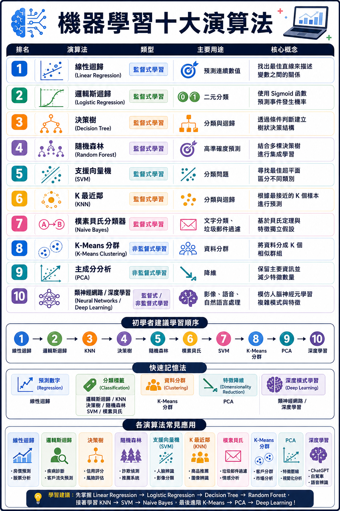

# HW5 - 機器學習十大演算法

本倉庫包含機器學習十大演算法的精美整理圖表，以及一個互動式網頁儀表板（Web Dashboard），幫助您深度學習並快速回顧這些核心演算法的運作機制與公式。

👉 **[線上互動網頁展示 (GitHub Pages)](https://gogogo137-cmyk.github.io/HW5/)**

## 內容介紹


1. **機器學習十大演算法資訊圖表**：
   - 檔名：`機器十大演算法.png`
   - 展示了 10 種最常見的機器學習演算法，涵蓋數值預測、標籤分類與資料分群降維。
   
2. **機器學習互動式網頁儀表板 (Interactive Dashboard)**：
   - 包含：`index.html`、`style.css`、`app.js`
   - **特色功能**：
     - **動態過濾與搜尋**：可依照監督式/無監督式、數值預測/分類/分群/降維等維度進行即時篩選，或透過關鍵字搜尋。
     - **網格與表格雙檢視**：支援在卡片牆和精簡表格視圖之間快速切換。
     - **抽屜式深度解析**：點選任何演算法即可在側邊滑出該演算法的數學核心公式、運作機制細節、快速記憶特點以及經典應用場景。
     - **互動式學習地圖**：視覺化展示 PDF 講義推薦的四階段學習黃金路徑，並提供點擊互動。
     - **實戰成功修煉指引**：整理實務上建立專案與疊代調參的四大成功指南。

## 如何在本機運行網頁？

您只需雙擊開啟 `index.html` 即可在瀏覽器中直接啟動此精美的深色系儀表板（採用響應式設計，支援電腦版與手機版）：

```bash
# 或者您也可以透過任何本地 HTTP 伺服器啟動它，例如：
npx http-server .
```

## 預覽圖片


