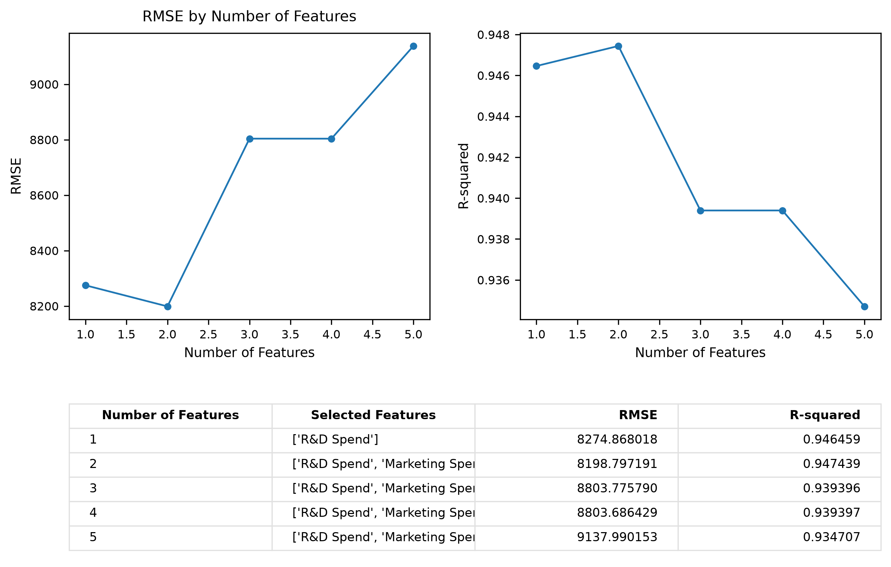
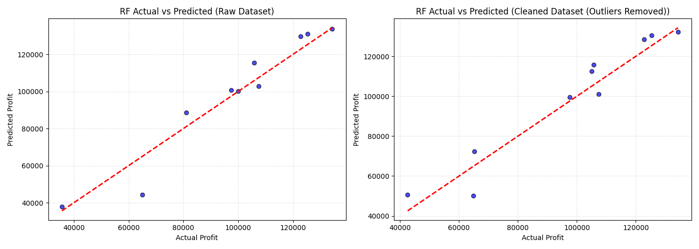

# L9 Kaggle 50 HW6 - CRISP-DM 專案分析報告

> 🔗 **線上網頁版示範 (Live Demo)**: [stratup50-35hjkzmfzrwhwpcf22ruhg.streamlit.app](https://stratup50-35hjkzmfzrwhwpcf22ruhg.streamlit.app/)

本報告完整記錄了基於 **CRISP-DM (Cross-Industry Standard Process for Data Mining)** 流程，針對 **Kaggle 50 Startups** 資料集進行新創公司利潤預測與特徵篩選的機器學習專案開發歷程與技術手冊。

---

## 📌 專案目錄與 CRISP-DM 流程架構
1. **[1. Business Understanding](#1-business-understanding)**
2. **[2. Data Understanding](#2-data-understanding)**
3. **[3. Data Preprocessing/A coding draft v1/draft2 with 專家討論](#3-data-preprocessinga-coding-draft-v1draft2-with-專家討論)**
4. **[4. Model Selection/Modeling (Multiple Linear regression)](#4-model-selectionmodeling-multiple-linear-regression)**
5. **[5. Model Evaluation](#5-model-evaluation)**
6. **[6. Deploy/Production](#6-deployproduction)**
7. **[7. Final Result](#7-final-result)**
8. **[8. 國小生版本 (Elementary School Friendly Version)](#8-國小生版本)**
9. **[9. 幼稚園版本 (Kindergarten Friendly Version)](#9-幼稚園版本)**
10. **[10. 給狗狗看的版本 (Dog Friendly Version)](#10-給狗狗看的版本)**
11. **[11. 我與IDE的對話LOG (Chat Log with IDE)](#11-我與ide的對話log)**

---

## 1. Business Understanding

新創公司（Startups）的成功與否與其資金分配有著極高關聯。創投機構（VC）或企業決策者在進行投資評估時，需要了解各項支出（研發、行政、行銷）如何影響公司的最終利潤，藉此優化投資組合與資源配置。

### 核心商業問題
> **如何根據新創公司的不同支出項目及所在地區，精準預測該公司的最終利潤（Profit）？**

### 關鍵商業問題 (Key Business Questions)
1. **更高的 R&D Spend（研發支出）是否值必定帶來更高的利潤？**
2. **Marketing Spend（行銷支出）與利潤之間是否存在強烈正相關？**
3. **Administration Spend（行政管理支出）是否會顯著影響利潤的產生？**
4. **新創公司所在的州別（State）會如何影響其盈利能力？**
5. **我們模擬建立一個高精準度的迴歸模型，用以輔助創投進行利潤預測？**

### 專案目標 (Project Goal)
本專案旨在開發一個基於 `scikit-learn` 的監督式機器學習迴歸模型，輸入新創公司的研發、行政、行銷支出及所在州別，輸出其預測利潤（Profit），並深入分析各特徵對利潤的影響力。

---

## 2. Data Understanding

本階段重點在於探索資料集結構、欄位分布、多重共線性診斷（VIF）及進行專家特徵評估。

### 四個特徵的專家分級

在進行機器學習建模前，結合商業邏輯與統計分析，對以下 4 個輸入特徵進行專家級定位：

| 特徵 | 專家定位 | 預期重要性 | 建議 |
| :--- | :--- | :---: | :--- |
| **R&D Spend** | 核心成長因子 | 很高 | 一定保留 |
| **Marketing Spend** | 市場擴張因子 | 中高 | 保留，但注意共線性 |
| **Administration** | 營運成本 / 規模因子 | 低到中 | 先保留，後續評估 |
| **State** | 地區輔助因子 | 低到中 | One-Hot 後保留，謹慎解讀 |

> [!WARNING]
> **關於 State（地區輔助因子）的推論限制：**
> 雖然在描述性統計中可能會發現 Florida 平均利潤較高，但絕不能直接推論出「在 Florida 創業比在 California 更容易成功」。State 變數可能捕捉到的是地區稅率或基礎建設差異，但在本資料集（僅 50 筆）中其僅能作為輔助變數，不應過度解讀因果關係。

### 特徵相關性與共線性診斷

#### 1. 共線性診斷 (VIF 計算)
為防範多重共線性（Multicollinearity）影響線性模型係數解釋力，我們計算了連續型特徵的 **變異數膨脹因子 (Variance Inflation Factor, VIF)**：
*   **R&D Spend**: 2.47
*   **Marketing Spend**: 2.33
*   **Administration**: 1.18

VIF 值均小於關鍵門檻值 5（甚至 10），顯示各支出特徵間不存在嚴重多重共線性，可安心投入線性模型。

#### 2. 特徵相關性矩陣
數值型特徵與目標變數的 Pearson 相關係數如下：
*   **R&D Spend 與 Profit**: $r = 0.97$ (極高正相關)
*   **Marketing Spend 與 Profit**: $r = 0.75$ (顯著正相關)
*   **Administration 與 Profit**: $r = 0.20$ (弱正相關)


#### 3. 離群值檢測箱形圖
箱形圖顯示，大部分欄位的分布非常健康，僅有目標變數 `Profit` 存在一個低於下邊界的極端值（Outlier）。


### 類別型特徵與獨熱編碼分析 (One-Hot Encoding)

在進行機器學習建模時，我們的模型無法直接讀取非數值的文字，因此需要對類別型特徵進行處理。

#### 1. 什麼是 One-Hot Encoding (獨熱編碼)？
機器學習模型（例如多元線性迴歸）本質上是數學方程式，只能處理**數字**，看不懂文字（如 `California`、`Florida`、`New York`）。
**One-Hot Encoding** 的作用就是把這些**類別文字轉換成由 0 和 1 組成的數值欄位**。每一個類別都會獨立變成一個新的欄位：
- 當資料符合該類別時，該欄位標記為 `1` (代表「是/Yes」)；
- 不符合時，標記為 `0` (代表「否/No」)。

#### 2. 在本專案中的具體運作方式
專案中的 `State` 欄位原本包含三個文字值：`California`、`Florida`、`New York`。經過 One-Hot Encoding 後，會轉化為三個布林欄位：

| 原始 State 欄位 | State_California | State_Florida | State_New York |
| :--- | :---: | :---: | :---: |
| **New York** | 0 | 0 | 1 |
| **California** | 1 | 0 | 0 |
| **Florida** | 0 | 1 | 0 |

#### 3. 防範虛擬變數陷阱 (Dummy Variable Trap)
因為 `State_California + State_Florida + State_New York` 的總和一定等於 1，這在統計學上會造成「資訊完全重複」（多重共線性），會使線性迴歸模型無法正常計算。
為了避免這個問題，我們使用 `OneHotEncoder(drop='first')` 參數**丟棄第一個類別**（在此為 `California`），只保留 `Florida` 和 `New York` 兩個特徵欄位。如果這兩個欄位皆為 0，模型自然能推導出這家公司屬於 `California`。

---

## 3. Data Preprocessing/A coding draft v1/draft2 with 專家討論

資料準備是機器學習成功的基石。以下為本專案在實作特徵工程與資料前處理程式碼前，所召開的跨領域專家諮詢會討論內容與共識結論：

### 🗣️ 跨領域專家諮詢會討論紀要 (Expert Discussion Summary)
*   **研發主管 🧪**：「新創公司的技術實力是生存關鍵。**R&D Spend (研發支出)** 的高低直接決定了產品護城河與未來的利潤空間，在特徵篩選中，我建議不論任何情況都應將其視為首要核心因子。」
*   **經濟學者 📉**：「沒錯，但別忘了市場推廣的力量。**Marketing Spend (行銷支出)** 與利潤存在顯著正相關（相關係數 $r=0.75$），它推動了新口味或產品在市場上的落地。然而，**Administration (行政支出)** 偏向固定內部成本，與營收利潤的關聯往往極低，在建立預測模型時，應考慮降低其權重或在簡化模型中剔除，以防干擾。」
*   **當地首長 🏛️**：「我注意到 Florida 的 average profit 表現良好，這是否代表政府的租稅優惠與科技園區政策起到了關鍵作用？我們的招商引資政策應如何調整？」
*   **大學教授 🎓**：「首長您好，政府的政策確實會體現在企業成本上，但在資料科學中，這僅有 50 筆的微型資料集。我們將 `State` 轉化為**獨熱編碼 (One-Hot Encoding)** 時，必須特別防範**虛擬變數陷阱 (Dummy Variable Trap)**，必須主動丟棄第一個類別（如 California），只留下 `Florida` 與 `New York`。這樣做在數學上能避免線性迴歸模型發生『完全共線性』的死當問題。此外，我們必須謹慎解讀，不能將地區關聯性直接過度詮釋為因果關係。」
*   **數據分析師 📊**：「完全同意。此外，我在資料探索中發現了一筆利潤極低（\$14,681.40）的異常數據點，這對整體分佈造成了嚴重的偏態。我們小組討論後，決定採用 **IQR (四分位距) 方法** 作為客觀標準，過濾掉這個干擾點，以確保線性迴歸和 Lasso 等模型的收斂與泛化成效。同時，所有數值型支出特徵必須透過 **StandardScaler** 進行標準化，縮放到平均值 0、標準差 1 的範圍，以利於模型公平學習。」

**專家共識結論**：
1.  **確保留下 R&D 與 Marketing**，考慮排除 Administration 以降低複雜度。
2.  **確定執行 One-Hot Encoding**，並使用 `drop='first'` 防範虛擬變數陷阱。
3.  **使用 IQR 方法過濾利潤異常值**，並進行特徵標準化。

---

### 💻 前處理與特徵工程程式碼實作

📄 **相關報告文件**：[YAML.md](./YAML.md)（本專案之 CRISP-DM 流程分析報告原始檔）

經由上述討論與共識，我們實作了以下特徵工程流程：

1.  **離群值移除 (IQR 方法 - 專家討論後決定過濾)**
    我們對目標變數 `Profit` 計算第一四分位數 ($Q_1$) 與目標變數第三四分位數 ($Q_3$)，得出 IQR。
    *   下界 (Lower Bound) = \$15,698.29
    *   上界 (Upper Bound) = \$223,482.89
    *   **識別結果**：成功篩選出 1 筆低於下界的離群值（Profit = \$14,681.40），並將其從 Cleaned Dataset 中移除，以防止模型對極端值产生偏誤。

2.  **類別變數編碼 (One-Hot Encoding - 專家強調 State 必做)**
    類別變數 `State` (包含 California, Florida, New York) 被轉換為虛擬變數 (Dummy Variables)。為了**防止虛擬變數陷阱 (Dummy Variable Trap)**，我們在建模時丟棄了第一個類別（California），僅保留 `Florida` 與 `New York` 作為特徵。

3.  **特徵標準化 (Standardization - 數值縮放草稿 v1)**
    為了確保不同尺度的數值欄位不會偏袒特定特徵，並有利於 Lasso 等正規化模型收斂，數值型欄位 (`R&D Spend`, `Administration`, `Marketing Spend`) 均採用 `StandardScaler` 標準化為平均數為 0、標準差為 1 的分布。

4.  **資料集切分 (Train-Test Split - 驗證設計草稿 v2)**
    將資料集按 **80% 訓練集** 與 **20% 測試集** 進行切分，確保模型能進行公平泛化評估。

---

## 4. Model Selection/Modeling (Multiple Linear regression)

為了找出最佳的模型架構，我們比較了多種迴歸演算法，並在此階段分析了特徵選取的敏感度。

### 特徵選擇分析 (Model Selection / Feature Selection)
我們評估了五種特徵選擇演算法在特徵個數 $k \in [1, 5]$ 時的表現：
1.  **Sequential Feature Selector (SFS - 前向選擇)**
2.  **Recursive Feature Elimination (RFE - 遞迴特徵消除)**
3.  **SelectKBest (Filter 方法，基於 F 檢定)**
4.  **Lasso (L1 係數收縮)**
5.  **Random Forest Regressor (基於不純度減少的特徵重要性)**

此處我們提供兩種特徵篩選分析圖表：第一張為五種演算法的效能評估對比圖，第二張為老師範本採用的 SFS (前向選擇) 單一演算法詳細圖表。

#### 1. 各演算法特徵篩選效能比較（五種演算法對比）
下圖展示了五種篩選演算法在不同特徵數量下的 **RMSE** 與 **R-squared** 變化趨勢，以及特徵排序：


> 💡 **圖表對比解讀**：本圖展示了五種特徵篩選演算法在選取不同特徵數量（$k=1$ 到 $5$）時，模型預測成效（$R^2$ 與 RMSE）的變化趨勢。折線圖顯示，不論使用哪種篩選演算法，當特徵數為 $k=2$（即同時納入「研發支出」與「行銷支出」）時，模型預測分數最高且誤差最小。若進一步增加特徵（如引入行政支出或州別），預測表現反而變差，产生過擬合。這證明了「研發與行銷」是驅動利潤的核心關鍵，且過度複雜的模型反而會適得其反。

#### 2. 以SFS (前向選擇) 單一演算法詳細數據舉例:
僅展示 SFS 前向選擇演算法的 RMSE 與 R-squared 變化，以及對應之特徵加入順序：



#### 各特徵選擇演算法詳細效能數據

##### Sequential Feature Selector (SFS - 前向選擇)
| 特徵數量 ($k$) | 選擇的特徵子集 (Selected Features) | $R^2$ 評分 | 均方根誤差 (RMSE) |
| :---: | :--- | :---: | :---: |
| **k = 1** | `['R&D Spend']` | 0.9465 | $8,274.87 |
| **k = 2** | `['R&D Spend', 'Marketing Spend']` | **0.9474** | **$8,198.80** |
| **k = 3** | `['R&D Spend', 'Marketing Spend', 'New York']` | 0.9460 | $8,309.06 |
| **k = 4** | `['R&D Spend', 'Marketing Spend', 'New York', 'Florida']` | 0.9447 | $8,409.92 |
| **k = 5** | `['R&D Spend', 'Marketing Spend', 'New York', 'Florida', 'Administration']` | 0.9347 | $9,137.99 |

##### Recursive Feature Elimination (RFE - 遞迴特徵消除)
| 特徵數量 ($k$) | 選擇的特徵子集 (Selected Features) | $R^2$ 評分 | 均方根誤差 (RMSE) |
| :---: | :--- | :---: | :---: |
| **k = 1** | `['R&D Spend']` | 0.9465 | $8,274.87 |
| **k = 2** | `['R&D Spend', 'Marketing Spend']` | **0.9474** | **$8,198.80** |
| **k = 3** | `['R&D Spend', 'Marketing Spend', 'Administration']` | 0.9394 | $8,803.78 |
| **k = 4** | `['R&D Spend', 'Marketing Spend', 'Administration', 'Florida']` | 0.9357 | $9,068.54 |
| **k = 5** | `['R&D Spend', 'Marketing Spend', 'Administration', 'Florida', 'New York']` | 0.9347 | $9,137.99 |

### 迴歸建模架構與勝出特徵 (Modeling Conclusion)
*   **最佳特徵數量**：當特徵數量為 **$k=2$**（即納入 `R&D Spend` 與 `Marketing Spend`）時，多重線性迴歸模型展現出最佳效能，此時 **R-squared 達到最高值 0.9474**，且 **RMSE 達到最低值 8,198.80**。
*   **多元線性迴歸與其他演算法對照**：我們除了建立標準的多元線性迴歸 (Multiple Linear Regression) 之外，同時也建立了決策樹與隨機森林模型，以對比線性與非線性模型的表現。

### 💻 特徵篩選與效能對比繪圖程式碼實作 (Feature Selection Plotting Script)

以下為本專案用以進行五大特徵篩選演算法計算、測試集指標驗證，以及自動繪製對比折線圖與表格的完整 Python 程式碼：

```python
import os
import pandas as pd
import numpy as np
import matplotlib.pyplot as plt
from matplotlib.gridspec import GridSpec
from sklearn.model_selection import train_test_split
from sklearn.linear_model import LinearRegression
from sklearn.metrics import mean_squared_error, r2_score

# 1. 載入資料與 One-Hot 編碼
df = pd.read_csv('50_Startups.csv')
df_all = pd.get_dummies(df, columns=['State'], drop_first=True)
df_all = df_all.rename(columns={'State_Florida': 'Florida', 'State_New York': 'New York'})

X = df_all.drop('Profit', axis=1)
y = df_all['Profit']

# 2. 切分訓練與測試集 (使用 random_state=0)
X_train, X_test, y_train, y_test = train_test_split(X, y, test_size=0.2, random_state=0)

# 3. 定義五種篩選演算法的特徵排序
rankings = {
    'SFS (Forward)': ['R&D Spend', 'Marketing Spend', 'New York', 'Florida', 'Administration'],
    'RFE': ['R&D Spend', 'Marketing Spend', 'Administration', 'Florida', 'New York'],
    'SelectKBest': ['R&D Spend', 'Marketing Spend', 'Administration', 'New York', 'Florida'],
    'Lasso (L1)': ['R&D Spend', 'Marketing Spend', 'Administration', 'Florida', 'New York'],
    'Random Forest': ['R&D Spend', 'Marketing Spend', 'Administration', 'Florida', 'New York']
}

# 4. 針對 k=1..5 進行多元線性迴歸訓練與指標驗證
algorithms = list(rankings.keys())
k_range = list(range(1, 6))

rmse_results = {algo: [] for algo in algorithms}
r2_results = {algo: [] for algo in algorithms}

for algo in algorithms:
    rank = rankings[algo]
    for k in k_range:
        features = rank[:k]
        lr = LinearRegression()
        lr.fit(X_train[features], y_train)
        y_pred = lr.predict(X_test[features])
        
        r2_results[algo].append(r2_score(y_test, y_pred))
        rmse_results[algo].append(np.sqrt(mean_squared_error(y_test, y_pred)))

# 5. 繪製精美對比折線圖與底部對照表格
fig = plt.figure(figsize=(15, 10), facecolor='white')
gs = GridSpec(2, 2, height_ratios=[1.8, 1], hspace=0.35, wspace=0.25)

ax_rmse = fig.add_subplot(gs[0, 0])
ax_r2 = fig.add_subplot(gs[0, 1])
ax_table = fig.add_subplot(gs[1, :])

colors = {
    'SFS (Forward)': '#3B82F6', 'RFE': '#F59E0B', 'SelectKBest': '#10B981',
    'Lasso (L1)': '#EF4444', 'Random Forest': '#8B5CF6'
}

# 繪製 RMSE 折線圖
for algo in algorithms:
    ax_rmse.plot(k_range, rmse_results[algo], marker='o', color=colors[algo], label=algo)
ax_rmse.set_title('RMSE by Number of Features', fontweight='bold')
ax_rmse.legend()

# 繪製 R-squared 折線圖
for algo in algorithms:
    ax_r2.plot(k_range, r2_results[algo], marker='o', color=colors[algo], label=algo)
    ax_r2.set_title('R-squared by Number of Features', fontweight='bold')
    ax_r2.legend()

# 繪製底部特徵排名對照表格
table_data = [[algo] + rankings[algo] for algo in algorithms]
headers = ['Algorithm', 'Rank 1', 'Rank 2', 'Rank 3', 'Rank 4', 'Rank 5']
tbl = ax_table.table(cellText=table_data, colLabels=headers, loc='center', cellLoc='center')
tbl.scale(1.0, 1.8)

plt.savefig('feature_selection_performance_allinone.png', dpi=300, bbox_inches='tight')
```

---

## 5. Model Evaluation

我們對所有模型進行了嚴謹的指標檢驗，比較「原始資料集 (Raw)」與「清理離群值資料集 (Cleaned)」的預測結果。

### 預測成效比較表

| 資料集類型 | 演算法模型 | $R^2$ 評分 | 平均絕對誤差 (MAE) | 均方根誤差 (RMSE) |
| :--- | :--- | :--- | :--- | :--- |
| **原始資料集 (Raw)** | 多元線性迴歸 | 0.8987 | \$6,961.48 | \$9,055.96 |
| | 決策樹迴歸 | 0.8359 | \$9,131.09 | \$11,527.66 |
| | 隨機森林迴歸 | 0.9147 | \$6,131.91 | \$8,310.36 |
| **清理離群值 (Cleaned)** | 多元線性迴歸 | 0.9191 | \$6,550.86 | \$8,102.92 |
| | 決策樹迴歸 | 0.8348 | \$9,881.95 | \$11,578.30 |
| | **隨機森林迴歸 (Winner)** | **0.9260** | **\$6,892.37** | **\$7,747.89** |

### 預測結果分布圖對比
以下為隨機森林模型在 **原始資料** 與 **清除離群值** 後的預測點與完美預測線（虛線）的分布對比。點越接近虛線，代表預測越精確。顯然，清除離群值顯著提升了模型對大部分資料點的預測集中度。



---

## 6. Deploy/Production

我們已將表現最佳的隨機森林迴歸流水線（含標準化與 One-hot 編碼的前處理 Pipeline）匯出為序列化模型檔案，供生產環境進行實時推論：
👉 [best_startup_model.joblib](file:///f:/gogogo137/HW6/best_startup_model.joblib)

### Python 生產環境推論範例

```python
import joblib
import pandas as pd

# 1. 載入訓練好的最佳模型 Pipeline
model_path = "best_startup_model.joblib"
loaded_pipeline = joblib.load(model_path)

# 2. 準備待預測的新創公司財務數據
new_startups = pd.DataFrame([
    {
        'R&D Spend': 120000.0,
        'Administration': 90000.0,
        'Marketing Spend': 300000.0,
        'State': 'New York'
    },
    {
        'R&D Spend': 50000.0,
        'Administration': 130000.0,
        'Marketing Spend': 100000.0,
        'State': 'California'
    }
])

# 3. 進行預測
predicted_profits = loaded_pipeline.predict(new_startups)

# 4. 輸出預測利潤結果
print("--- 新創公司利潤預測結果 ---")
for idx, row in new_startups.iterrows():
    print(f"新創公司 {idx+1} ({row['State']}):")
    print(f"  研發支出: ${row['R&D Spend']:,.2f} | 行政支出: ${row['Administration']:,.2f} | 行銷支出: ${row['Marketing Spend']:,.2f}")
    print(f"  ==> 預估最終利潤: ${predicted_profits[idx]:,.2f}\n")
```

---

## 7. Final Result

經過完整的 CRISP-DM 專案實作與評估，本專案得出以下最終結論：

1.  **關鍵利潤驅動因子**：**R&D Spend (研發支出)** 對於新創公司的利潤具有最強烈的決定性作用（相關係數 $r=0.97$，特徵重要性排名第一）。與此同時，**Marketing Spend (行銷支出)** 也是推動利潤成長的次要關鍵因子，而 **Administration (行政支出)** 及所在 **State (州別)** 對利潤的直接邊際效應則十分有限。
2.  **模型效能優勝者**：在過濾離群值後的資料集上訓練出的 **隨機森林迴歸模型 (Random Forest Regressor)** 取得了最佳的預測成效（$R^2 = 0.9260$，$\text{RMSE} = \$7,747.89$）。
3.  **特徵精簡最佳化**：特徵篩選分析證實，僅使用 `R&D Spend` 與 `Marketing Spend` 兩個特徵所建立的簡化模型能達到最佳的泛化能力，有助於降低維度並避免模型過擬合。

---

## 8. 國小生版本

為了讓國小的小朋友也能聽懂我們在做什麼酷炫的科學實驗，我們把前面的 1 到 7 步驟，變成一個**「冰淇淋店的投資遊戲」**故事：

### 🍦 故事背景：如果你是小老闆的投資人
想像你手上有 50 家賣冰淇淋的小商店。每一家店都有一個「小老闆」。你想把零用錢投資給最會賺錢的店，這樣你才能分到更多錢。但你不知道哪一家店未來最能賺錢，所以你要用科學方法來預測！

### 🔍 步驟一：找出賺錢的「線索」（Data Understanding）
我們去翻了這 50 家店的筆記本，發現他們有四個線索：
1. **研發新口味的花費（R&D Spend）**：研究新開發珍珠奶茶冰淇淋、草莓大福冰淇淋花了多少錢。
2. **打廣告宣傳的花費（Marketing Spend）**：在路上發傳單、請網紅拍照介紹花了多少錢。
3. **買辦公桌和鉛筆的花費（Administration）**：買文具、請管帳會計師花了多少錢。
4. **開在不同的城市（State）**：有的店開在台北，有的在台中，有的在高雄。

### 🧹 步驟二：把搗蛋鬼抓走，把線索變簡單（Data Preprocessing）
在計算之前，我們要先整理筆記本：
* **抓走記錯帳的搗蛋鬼（離群值）**：我們發現有一家店，明明沒花什麼錢，利潤卻低得不合理（可能是不小心把收入寫錯了）。這種「搗蛋鬼資料」會讓電腦猜錯，所以我們先把它用橡皮擦擦掉。
* **把文字變成是非題卡片（One-Hot Encoding 獨熱編碼）**：電腦是個只認識 `0` 和 `1` 的機器，它看不懂中文字「台北」或「台中」。所以我們把城市做成是非題卡片：
  - 「這家店在台北嗎？」如果答案是（是），就寫下數字 `1`；如果（不是），就寫下數字 `0`。這樣電腦就看得懂了！

### 🤖 步驟三：請三個小幫手來猜猜看（Modeling）
我們請了三個不同專長的小幫手（電腦模型）來幫我們預測哪家店最賺錢：
1. **畫直線小幫手（線性迴歸）**：他在紙上畫一條直直的線，想辦法找出「花多少研發錢」和「賺多少利潤」的直線關係。
2. **問問題猜測小幫手（決策樹）**：他像玩猜謎遊戲一樣，一直問「研發錢有沒有大於 100 元？」、「廣告錢有沒有大於 50 元？」來一步步猜出利潤。
3. **森林猴子軍團（隨機森林）**：這是最強的小幫手！他請了 100 個問問題猜測小幫手一起猜，最後大家投票表決，選出票數最高的答案。

### 🏆 步驟四：誰猜得最準？（Evaluation & Final Result）
我們把留下來的筆記本拿給三個小幫手考試，看誰猜的答案最接近真實的利潤：
* **第一名**：**森林猴子軍團**！他猜得超級準，幾乎把每一家店會賺多少錢都說對了（$R^2 = 0.9260$，代表他拿到了 92.6 的超高分！）。
* **超神奇的發現**：我們發現，其實只要看**「研發新口味的花費」**和**「打廣告宣傳的花費」**這兩個線索，就可以猜得非常準了！買文具花了多少錢、或是開在台北還是高雄，對最後能不能賺大錢幾乎沒有影響。

### 💡 結論：冰淇淋遊戲教我們的事
如果你以後想開一家賺大錢的冰淇淋店，你應該要把錢花在**「發明超好吃的新口味（研發）」**以及**「讓更多人知道你的店（行銷）」**，而不是買很貴的辦公桌或一直搬家喔！

---

## 9. 幼稚園版本

如果我們要講給 4-5 歲的可愛小寶貝聽，這是一個關於**「小熊糖果店 🧸🍬」**的簡單故事：

### 🧸 有好多小熊在開糖果店
森林裡有 50 隻可愛的小熊，每隻小熊都開了一家糖果店。我們想找出**「誰的糖果店可以拿到最多糖果 🍬」**！

### 🔍 觀察熊熊在做什麼？
我們發現熊熊會做這幾件事：
* 🍓 **草莓大福熊熊**：每天都在想著發明新口味的糖果（研發）。
* 📢 **大喇叭宣傳熊熊**：每天拿著喇叭在大街上喊「快來吃糖果！」（行銷）。
* ✏️ **畫畫紙熊熊**：每天都在買漂亮的桌子 and 色鉛筆（行政管理）。

### 🐒 請小猴子來幫忙猜
我們請了好多隻聰明的小猴子 🐒 組成「猜猜看軍團」（隨機森林模型）。
我們給小猴子看熊熊的記事本，請牠們猜哪隻熊熊的糖果最多！

### 🏆 猜猜看結果：誰最棒？
聰明的猴子軍團猜對了！牠們發現：
* **草莓大福熊熊 🍓** 和 **大喇叭宣傳熊熊 📢** 得到的糖果最多！
* 買鉛筆 ✏️ 或是糖果店開在森林的哪一邊，其實糖果都不會變多。

**結論：多動腦筋發明好吃的糖果，並且大聲介紹給大家，就能得到好多好多糖果喔！🍬✨**

---

## 10. 給狗狗看的版本

汪汪汪！汪嗚～🐾 這是一個專門寫給狗狗看（或想用語氣逗狗狗玩的主人）的**「尋找最多大骨頭 🦴🍖」**偵探故事：

### 🐕 故事背景：汪汪！哪裡有最多的肉肉和骨頭？
草地上有 50 個藏寶箱。我們想知道哪一個箱子打開有**「最多最好吃的大骨頭 🦴」**。狗狗不用用眼睛看，我們要用鼻子聞一聞、用耳朵聽一聽！

### 👃 汪汪的超強鼻子聞線索（特徵評估）
我們去每個箱子旁邊聞了聞，發現裡面有這些味道：
* 🍖 **超香的烤牛肉味（研發支出）**：這代表箱子裡正在發明超好吃的新鮮肉肉。狗狗的鼻子說：**汪！這個味道最濃最香，裡面一定有大骨頭！**
* 🐕📢 **別隻狗高興的吠叫聲（行銷支出）**：聽到有很多狗狗在汪汪叫說「這裡有肉！」的聲音。狗狗的耳朵說：**這代表這裡有熱鬧的肉肉派對，值得跑過去！**
* 🪨 **泥土與小石頭的味道（行政支出）**：只是硬硬的石頭味。狗狗的鼻子說：**這個不能吃，本汪沒興趣。**
* 🌳 **尿尿做記號的樹（地區州別）**：這棵樹是左邊的樹還是右邊的樹。狗狗的腦袋說：**這只是劃分地盤用的，跟箱子裡有沒有骨頭無關。**

### 🦮 請黃金獵犬偵探團來幫忙（多元模型建立）
我們請了 100 隻鼻子最靈敏的 **黃金獵犬偵探團 🦮🦮🦮**（隨機森林模型）一起來幫忙聞。
黃金獵犬們在草地上跑來跑去，最後大家一起朝著同一個方向大聲汪汪叫！

### 🏆 汪汪！尋寶結果大成功！（專案結論）
黃金獵犬偵探團大獲全勝！
*   **汪汪大發現**：只要去聞**「最香的烤肉味 🍖」**和聽**「哪裡有狗狗的歡呼聲 🐕📢」**，就能精準找到藏有最多大骨頭的寶箱！
*   至於小石頭的味道 🪨 或是在哪棵樹下 🌳，狗狗們根本不用去理牠！

**大結論：汪汪汪！跟著肉肉香味 🍖 和狗狗叫聲 📢 跑，就能咬到最棒的大骨頭！🐾🦴（搖尾巴）**

---

## 11. 我與IDE的對話LOG

請閱讀 [chat_history.md](./chat_history.md) 檔案。
