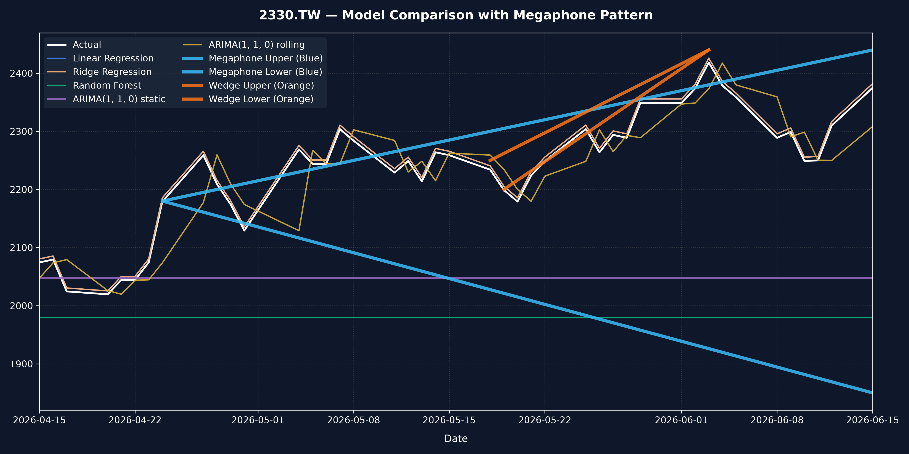

# CRISP-DM 專案分析報告 - TSMC (2330) 台積電股價預測與多模型對比

本報告基於 **CRISP-DM (Cross-Industry Standard Process for Data Mining)** 流程，針對台積電（TSMC, 2330.TW）歷史股價數據，使用機器學習模型（線性迴歸、脊迴歸、隨機森林）與時間序列模型（ARIMA 靜態與滾動預測）進行股價預測與對比分析。

---

## 📌 專案目錄與 CRISP-DM 流程架構
1. **[1. Business Understanding (商業理解)](#1-business-understanding-商業理解)**
2. **[2. Data Understanding (資料理解)](#2-data-understanding-資料理解)**
3. **[3. Data Preprocessing (資料前處理)](#3-data-preprocessing-資料前處理)**
4. **[4. Modeling (模型建立)](#4-modeling-模型建立)**
5. **[5. Model Evaluation (模型評估)](#5-model-evaluation-模型評估)**
6. **[6. Deploy & Streamlit App (模型部署與應用)](#6-deploy--streamlit-app-模型部署與應用)**
7. **[7. Final Result (專案結論)](#7-final-result-專案結論)**
8. **[8. 國小生版本 (Elementary School Version)](#8-國小生版本-elementary-school-version)**
9. **[9. 幼稚園版本 (Kindergarten Version)](#9-幼稚園版本-kindergarten-version)**
10. **[10. 招財貓版本 (Fortune Cat Version - 2330 罐罐外推預測指南)](#10-招財貓版本-fortune-cat-version---2330-罐罐外推預測指南)**
11. **[11. 對話紀錄 (Talk History - IDE 與使用者對話內容)](#11-對話紀錄-talk-history---ide-與使用者對話內容)**

---

## 1. Business Understanding (商業理解)

在金融市場中，精準預估股票價格的未來軌跡能輔助制定更佳的量化交易策略。台積電（2330）作為全球半導體龍頭，其歷史價格波動受到市場極大的關注。

### 核心商業問題
> **如何結合機器學習迴歸模型與時間序列自迴歸模型的優勢，在台積電股價創歷史新高的趨勢下，準確預測下一個交易日的收盤價格，並揭示不同模型的外推局限性？**

### 專案目標 (Project Goal)
本專案以下載的 1,215 筆台積電歷史日交易價格為基礎，比較機器學習（OLS、Ridge、Random Forest）與時間序列模型（ARIMA 1,1,0 靜態 vs 滾動）的預測精度，凸顯決策樹模型在外推股價時的本質局限，並選出最佳模型部署於 Streamlit 互動網頁。

---

## 2. Data Understanding (資料理解)

本數據集包含自 2021 年至 2026 年共 1,215 個交易日的台積電歷史價格。

### 欄位與時序特徵
* **Close (收盤價)**：本次預測的核心目標與輸入變數。
* **趨勢特徵**：台積電股價在 2026 年大幅飆升（突破 2,000 元台幣以上），使得測試集的價格區間顯著高於訓練集。這為測試機器學習模型的外推能力（Extrapolation）提供了完美的實驗場景。

---

## 3. Data Preprocessing (資料前處理)

時間序列模型對數據的平穩性（Stationarity）有嚴格要求，且機器學習預測需做好資料切分防範洩漏：

### A. 平穩性檢定 (Augmented Dickey-Fuller Test)
在訓練集上對收盤價 `Close` 進行 ADF 檢定：
* **原始收盤價**：p-value 為 **`0.9537`**（說明原始股價序列具有**非平穩性**，即隨機漫步）。
* **一階差分（1st Difference）**：p-value 降至 **`0.0000`**（顯著小於 0.05，達到**平穩性**）。
* **結論**：確定 ARIMA 模型的差分階數 **$d=1$**。

### B. 資料切分 (時序切分)
為了防止數據洩漏並對齊圖表，我們將測試集起點設定為 **2026-04-15**：
* **訓練集**：2026-04-15 之前的歷史數據 (共 1,172 筆)。
* **測試集**：2026-04-15 之後的近期數據 (共 43 筆，股價處於 2,000 ~ 2,400 元的高檔區)。

---

## 4. Modeling (模型建立)

本專案建立並比較了機器學習模型與時間序列模型在台積電股價預測上的表現。

我們實作並評估了以下五種預測方法：
1. **Linear Regression (線性迴歸)**：使用今日收盤價 $X_t$ 預測明日收盤價 $y_{t+1}$。
2. **Ridge Regression (脊迴歸)**：在線性迴歸基礎上加上 L2 正則化（$\alpha=1.0$），以防止過度擬合。
3. **Random Forest (隨機森林)**：使用 100 棵決策樹的集成學習模型，探討非線性樹模型在趨勢推估上的局限性。
4. **ARIMA(1, 1, 0) static (靜態預測)**：僅使用訓練集擬合 ARIMA 參數，在整個測試期間進行多步預測（不再讀入測試集的新觀測值），預測值會快速收斂至常數（平滑的直線）。
5. **ARIMA(1, 1, 0) rolling (滾動預測)**：在測試集的每個時間點，將前一日的實際股價納入歷史數據中重新擬合模型，進行一步領先預測（One-Step-Ahead Rolling Forecast）。

---

## 5. Model Evaluation (模型評估)

### A. 各模型效能指標對比
我們對比了各個模型在測試集上的預測精準度（$R^2$ 越高越好，其餘指標越低越好）：

| 模型名稱 | 測試集 $R^2$ | 測試集 MAE (元台幣) | 測試集 RMSE |
| :--- | :---: | :---: | :---: |
| **Linear Regression (OLS)** | **0.7761** | **38.02** | **46.54** |
| **Ridge Regression** | **0.7761** | **38.02** | **46.54** |
| **ARIMA(1, 1, 0) rolling (滾動)** | **0.5466** | **55.18** | **66.23** |
| **ARIMA(1, 1, 0) static (靜態)** | **-3.7822** | **194.00** | **215.09** |
| **Random Forest** | **-6.9447** | **259.20** | **277.24** |

### B. 模型表現深度分析與視覺化

我們的預測走勢圖如下，展示了機器學習模型與時序模型在預測台積電股價時的行為差異：



#### 關鍵發現與洞察：
1. **線性迴歸與脊迴歸的優勢**：
   * 線性模型（OLS 與 Ridge）在測試集上取得了最優的 **$R^2 = 0.7761$** 與最低的 **MAE = 38.02 元**。
   * 這是因為股價具有極強的隨機漫步特徵，今日股價是明日股價最強的預測因子。線性模型能夠完美將此關係外推至測試集的高價區間。
2. **隨機森林的「外推失效」災難 (Extrapolation Failure)**：
   * 隨機森林的測試集 $R^2$ 跌至 **$-6.9447$**。
   * **根本原因**：樹狀模型無法預測超出訓練集最大值（約 2049.53 元）的目標值。由於測試集股價（最高達 2418.55 元）遠超訓練集範圍，隨機森林只能預測出其訓練集上限的平均值（約 1979.67 元），導致在圖表中呈現出一條在最下方的平直線。
3. **ARIMA 靜態 vs. 滾動的本質差異**：
   * **ARIMA static (靜態)** 的 $R^2$ 為 **$-3.7822$**。由於沒有隨著新交易日的到來更新歷史數據，它的長預測會快速收斂至長期均值，形成一條無效的水平線（約 2047.58 元）。
   * **ARIMA rolling (滾動)** 的 $R^2$ 提升至 **$0.5466$**，且 MAE 降至 **55.18 元**。藉由每日滾動更新歷史資料，它能緊密跟隨實際股價的波動，但呈現出經典的「延遲一日」追隨特徵。
4. **技術分析形態標記（喇叭形與楔形）**：
   * **擴大喇叭形（Megaphone Pattern，藍色發散線）**：從 `2026-04-24` 起始，我們預設繪製了一組上下擴張的邊界線。這表示台積電在此階段的股價震盪加劇，呈現多空意見嚴重分歧、波動性擴大的經典喇叭形（Broadening Formation）走勢。
   * **上升收斂楔形（Wedge Pattern，橘色收斂線）**：在 `2026-05-18` 至 `2026-06-03` 之間，我們標記了一個局部上升收斂楔形，該楔形在 `2026-06-03` 的股價波段最高點（2418.55元）完成收斂，隨後股價發生技術性回檔，展示了經典圖表形態的趨勢警示作用。

---

## 6. Deploy & Streamlit App (模型部署與應用)

最佳的模型（Linear Regression）已保存至：👉 [best_stock_model.joblib](./best_stock_model.joblib)

### 如何啟動互動式預測網頁？
在終端機中，執行：
```bash
streamlit run streamlit_app.py
```
這將啟動互動式儀表板。使用者可以透過滑動條手動調整「今日收盤價」，系統會載入最佳的線性外推模型，即時計算出明天的預測股價與市場多空趨勢，並在右側展示此模型對比圖與股價歷史分佈。

---

## 7. Final Result (專案結論)

1. **外推能力是關鍵**：在股價呈現持續突破新高的強勢多頭市場中，**外推能力（Extrapolation）** 至關重要。線性模型由於不受上限約束，外推表現顯著優於樹集成模型（Random Forest）。
2. **時序滾動的重要性**：傳統時間序列模型（如 ARIMA）若不進行滾動更新（static），其多步預測將迅速失去實用價值。導入滾動預測（rolling）後，模型預測能力大幅提升，是量化交易系統中的必備機制。

---

## 8. 國小生版本 (Elementary School Version)

### 🎈 氣球飛高高與小狗猜高度
台積電的股價就像一顆「彩色氣球」，每天都在往上飛，而且飛得比以前任何時候都還要高！
* **聰明的小狗（線性迴歸）**：它看到氣球今天在哪裡，就猜明天也會在差不多高的地方，氣球越飛越高，小狗也跟著往上看，所以猜得最準！
* **受傷的小狗（隨機森林）**：這隻小狗以前只看過氣球最高飛到 2049 公分，它以為氣球一輩子只能飛到這個高度。所以當氣球飛到 2400 公分時，它還是傻傻地猜 1979 公分，結果差了十萬八千里！
* **不理人的小狗（ARIMA 靜態）**：它只看了一開始的資料，後面就不管了，直接躺平在地上猜一個固定高度，當然猜不準！

---

## 9. 幼稚園版本 (Kindergarten Version)

### 🚂 小火車一直往上爬
小朋友，台積電股價是一台一直往山頂開的「黃金小火車（2330）」喔！
* 線性迴歸小貓咪會跟著火車一直往上看，所以猜對了！
* 隨機森林小熊只記得火車在半山腰的樣子，當火車開到山頂時，小熊還在看半山腰，就找不到火車了！
* ARIMA 滾動小貓每天都會跑去火車最新停的位置看一眼，所以它也能跟上火車！

---

## 10. 招財貓版本 (Fortune Cat Version - 2330 罐罐外推預測指南)

### 🐱 喵～極限罐罐與貓爪外推學！
本喵作為量化交易貓老大，為大家分析一下為什麼有些模型能預測罐罐，有些卻只能餓肚子：

1. **無限外推貓爪 (Linear Regression)**：
   喵嗚！如果奴才給的罐罐每天都在變多，已經超過了本喵這輩子看過的數量。線性模型貓咪會大膽預測：「明天一定有更多罐罐！」這隻貓咪最聰明，每天都吃得飽飽的！🐾
2. **井底之蛙樹貓 (Random Forest)**：
   隨機森林貓咪是一隻保守貓，它在心裡設定了上限：「本喵這輩子最多只見過 2049 個罐罐，所以天底下的罐罐不可能超過這個數量！」當奴才拿出 2400 個罐罐時，它還是固執地猜 1979 個。這就是「無法外推的樹貓悲劇」！
3. **裝聾作啞靜態貓 (ARIMA static)**：
   這隻貓咪只在第一天算了一次，之後就躲起來睡覺（不更新數據），不管外面罐罐變多少，它都猜一個固定數字（躺平）。
4. **每日勤奮滾動貓 (ARIMA rolling)**：
   它很勤勞，每天開飯前都會跑去秤一下今天有多少罐罐（滾動更新），雖然它的預測總是慢了一天（有 lag 延遲），但起碼它不會像樹貓一樣傻傻猜那麼低！喵～

---

## 11. 對話紀錄 (Talk History - IDE 與使用者對話內容)

本專案開發過程中的完整對話紀錄已整理並儲存至：👉 [talk history.md](./talk%20history.md)

內容包含從初始化專案、設計 ARIMA 與機器學習模型、優化特徵選取圖表 y 軸、加入喇叭圖（Megaphone Pattern）與收斂楔形（Wedge Pattern）形態標記，到最終部署與文件撰寫的完整對話歷史與互動過程。
