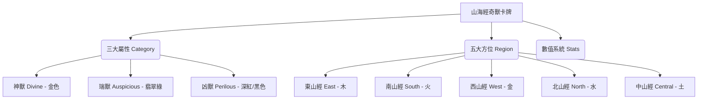

# 《山海經 · 奇獸對決》卡牌遊戲設計方案 (Proposal)

這是一個將《山海經 · 奇獸異誌》中的 450 隻神話異獸轉化為策略卡牌對戰遊戲（TCG/CCG）的方案。我們將依據現有的資料庫結構，篩選出最經典的 **200 隻異獸** 進行設計。

---

## ⚔️ 核心系統設計

現有資料庫的結構與卡牌遊戲的屬性設計有著天然的完美契合：



### 1. 三大屬性 (3 Categories - 相剋機制)
卡牌之間存在屬性相剋，剋制時攻擊力增加 30%：
* **神獸 (Divine)** ── **秩序與控場**。擅長法術、封印、干擾對手。剋制「凶獸」。
* **凶獸 (Perilous)** ── **高攻與毀滅**。擅長高額輸出、獻祭、給予負面狀態。剋制「瑞獸」。
* **瑞獸 (Auspicious)** ── **輔助與護盾**。擅長治療、增益（Buff）、抽牌與防禦。剋制「神獸」。

### 2. 五大方位與元素共鳴 (5 Regions - 場地機制)
戰場分為五個區域（對應五山經）。將卡牌放置在符合其出身方位的格子上時，會觸發**「方位共鳴 (Regional Synergy)」**，獲得額外加成：
* **東山經 (East / 木)** ── 獲得「再生」：每回合結束回復 15 點生命值（已實作）。
* **南山經 (South / 火)** ── 獲得「烈焰」：對決時戰力（ATK）提升 30%（已實作）。
* **西山經 (West / 金)** ── 獲得「破甲」：傷害提升 20%（已實作）。
* **北山經 (North / 水)** ── 獲得「冰結」：對決時 25% 機率凍結對手，使其無法進行攻擊與反擊（已實作）。
* **中山經 (Central / 土)** ── 獲得「萬能共鳴」：中山經卡牌在任何插槽（東、南、西、北）皆可觸發該插槽的屬性共鳴（已實作）。

---

## 🎴 卡牌視覺與數值設計 (Card Layout)

卡牌設計將融合山海經的水墨美學與現代 UI 框架，卡牌包含以下核心欄位：

```
+-----------------------------------+
|  [靈力消耗]  九尾狐 (ID)  [東山/瑞] |
| +-------------------------------+ |
| |                               | |
| |        水墨工筆畫插圖          | |
| |         (AI 生成 PNG)          | |
| |                               | |
| +-------------------------------+ |
| | 戰力 (ATK): 35   防禦 (DEF): 80| |
| +-------------------------------+ |
| | 【技能：妖邪不侵】            | |
| | 登場時，淨化我方場上所有負面  | |
| | 狀態，並使相鄰卡牌防禦+15。    | |
| +-------------------------------+ |
| |「青丘之山，有獸焉，其狀如狐..」| |
| +-----------------------------------+
```

### 數值換算公式：
每個卡牌的**召喚靈力消耗 (Cost)** 由其內置屬性決定：
$$\text{Cost} = \text{Round}\left(\frac{\text{Spiritual} + \text{Aggression} + \text{Rarity}}{30}\right)$$
* 範例：**九尾狐** (靈力 85, 戰力 35, 稀有度 80)
  $$\text{Cost} = \text{Round}\left(\frac{85 + 35 + 80}{30}\right) = 7\text{ 點靈力}$$

---

## 🎮 玩法機制設計 (Gameplay Mechanics)

1. **對戰準備**：雙方玩家各自構築一套由 **20 張卡牌** 組成的牌組。
2. **戰場配置**：戰場為 5 列（東、南、西、北、中），每列有 2 個格位（前鋒、後衛）。
3. **戰鬥流程**：
   * **抽牌階段**：雙方每回合開始抽 1 張牌，靈力上限增加 1 點（最多 10 點）並補滿。
   * **部署階段**：消耗靈力將卡牌部署到場上。
   * **衝突階段**：場上的卡牌進行對決。前鋒卡牌優先進行戰力（ATK）判定，若前鋒死亡，後衛將直接承受傷害。
4. **特殊技能機制（直接引用山海經原文設定）**：
   * **山膏** (善詈 - 善於罵人) ── 【技能：挑釁嘲諷】強制敵方單體下回合必須攻擊此卡，並降低敵方 20% 攻擊力。
   * **當扈** (以其髯飛) ── 【技能：凌空】無視防禦，直接攻擊敵方後衛。
   * **儵魚** (食之已憂 - 吃了可以忘憂) ── 【技能：清心】消除我方指定單體卡牌的混亂與冰凍效果。

---

## 📊 200 隻卡牌角色篩選標準

為了確保對戰的平衡性與趣味性，我們從 450 隻資料庫中挑選 **200 隻** 的篩選標準如下：
1. **數值獨特性**：排除重複性質過高的衍生型怪物，保留數據特徵鮮明的異獸。
2. **屬性分佈平衡**：
   * **神獸**：約 50 隻 (主打法術控場)
   * **瑞獸**：約 75 隻 (主打治療輔助)
   * **凶獸**：約 75 隻 (主打物理輸出)
3. **方位分佈平衡**：東山、南山、西山、北山、中山各約 40 隻，確保五個戰區皆有足夠的方位共鳴卡牌。

---

## 🛠️ 下一步開發實施計畫

如果您贊同這個方案，我們可以建立一個單獨的網頁（例如卡牌養成與對戰模擬器），實施步驟為：
1. **[NEW] 篩選腳本 (`filter_200_beasts.py`)**：用 Python 自動分析 `app.js`，按照平衡比例，精確篩選出 200 隻最強、最具特色的卡牌。
2. **[NEW] 卡牌 UI 組件**：在前端設計一個精緻的卡牌 HTML/CSS 模板，能將異獸名稱、屬性顏色、數值條、及 AI 插圖優雅展現。
3. **[NEW] 戰鬥模擬器 (`card-game.html`)**：建置一個小型的單機版卡牌擺放與對戰模擬小遊戲。


步驟一：建立篩選腳本 filter_200_beasts.py，從 450 隻資料庫中，依據平衡性（50神、75瑞、75凶）自動挑選出最經典的 200 隻卡牌。
步驟二：建立 card-game.html / card-game.js，在網頁上實作卡牌的基本屬性、精美卡牌 UI 以及擺放對戰的基本逻辑。

### 5. 陣營特殊特效 (Faction Synergy)
* **百鳥爭鳴 (Bird Chorus)** ── 當己方或敵方場上同時部署了 **3 隻或以上** 具有飛行速攻特徵（先手速度 `Initiative > 1`）的鳥類卡牌時，會發動此特效，干擾對方戰意，使對手全體卡牌的**戰力 (ATK) 降低 20%**。
* **天地五行齊聚 (Five Elements Complete)** ── 當玩家與敵方場上（共 8 個格子）同時部署了涵蓋**東 (木)、南 (火)、西 (金)、北 (水)、中 (土)** 五種地域出身的隨從卡牌時，在回合開始結算前自動觸發「五行大共鳴」，直接對敵方魔王造成 **30 點天罰傷害**，並為我方回復 **20 點生命值**。

---

好喔 就依照步驟執行，還有我想要做成人挑戰電腦的闖關遊戲，不要人對人了，我沒有朋友，我想說大家要找兩個人對戰業很困難，這個也都寫在CARDGAME裡面好了。