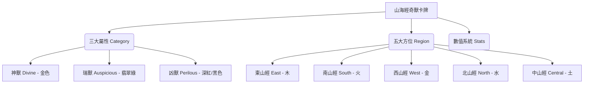

# 《山海經 · 奇獸對決》卡牌遊戲設計方案 (Proposal)

這是一個將《山海經 · 奇獸異誌》中的 450 隻神話異獸轉化為策略卡牌對戰遊戲（TCG/CCG）的方案。我們將依據現有的資料庫結構，篩選出最經典的 **200 隻異獸** 進行設計。

---

## ⚔️ 核心系統設計

現有資料庫的結構與卡牌遊戲的屬性設計有著天然的完美契合：



### 1. 三大屬性 (3 Categories - 相剋機制)
卡牌之間存在屬性相剋，剋制時攻擊力增加 30%：
* **神獸 (Divine)** ── **秩序與控場**。擅長法術、封印、干擾對手。剋制「凶獸」。
* **凶獸 (Perilous)** ── **高攻與毀滅**。擅長高額輸出、獻祭、給予負面狀態。剋制「瑞獸」。
* **瑞獸 (Auspicious)** ── **輔助與護盾**。擅長治療、增益（Buff）、抽牌與防禦。剋制「神獸」。

### 2. 五大方位與元素共鳴 (5 Regions - 場地機制)
戰場分為五個區域（對應五山經）。將卡牌放置在符合其出身方位的格子上時，會觸發**「方位共鳴 (Regional Synergy)」**，獲得額外加成：
* **東山經 (East / 木)** ── 獲得「再生」：每回合結束回復 15 點生命值（已實作）。
* **南山經 (South / 火)** ── 獲得「烈焰」：對決時戰力（ATK）提升 30%（已實作）。
* **西山經 (West / 金)** ── 獲得「破甲」：傷害提升 20%（已實作）。
* **北山經 (North / 水)** ── 獲得「冰結」：對決時 25% 機率凍結對手，使其無法進行攻擊與反擊（已實作）。
* **中山經 (Central / 土)** ── 獲得「萬能共鳴」：中山經卡牌在任何插槽（東、南、西、北）皆可觸發該插槽的屬性共鳴（已實作）。

---

## 🎴 卡牌視覺與數值設計 (Card Layout)

卡牌設計將融合山海經的水墨美學與現代 UI 框架，卡牌包含以下核心欄位：

```
+-----------------------------------+
|  [靈力消耗]  九尾狐 (ID)  [東山/瑞] |
| +-------------------------------+ |
| |                               | |
| |        水墨工筆畫插圖          | |
| |         (AI 生成 PNG)          | |
| |                               | |
| +-------------------------------+ |
| | 戰力 (ATK): 35   防禦 (DEF): 80| |
| +-------------------------------+ |
| | 【技能：妖邪不侵】            | |
| | 登場時，淨化我方場上所有負面  | |
| | 狀態，並使相鄰卡牌防禦+15。    | |
| +-------------------------------+ |
| |「青丘之山，有獸焉，其狀如狐..」| |
| +-----------------------------------+
```

### 數值換算公式：
每個卡牌的**召喚靈力消耗 (Cost)** 由其內置屬性決定：
$$\text{Cost} = \text{Round}\left(\frac{\text{Spiritual} + \text{Aggression} + \text{Rarity}}{30}\right)$$
* 範例：**九尾狐** (靈力 85, 戰力 35, 稀有度 80)
  $$\text{Cost} = \text{Round}\left(\frac{85 + 35 + 80}{30}\right) = 7\text{ 點靈力}$$

---

## 🎮 玩法機制設計 (Gameplay Mechanics)

1. **對戰準備**：雙方玩家各自構築一套由 **20 張卡牌** 組成的牌組。
2. **戰場配置**：戰場為 5 列（東、南、西、北、中），每列有 2 個格位（前鋒、後衛）。
3. **戰鬥流程**：
   * **抽牌階段**：雙方每回合開始抽 1 張牌，靈力上限增加 1 點（最多 10 點）並補滿。
   * **部署階段**：消耗靈力將卡牌部署到場上。
   * **衝突階段**：場上的卡牌進行對決。前鋒卡牌優先進行戰力（ATK）判定，若前鋒死亡，後衛將直接承受傷害。
4. **特殊技能機制（直接引用山海經原文設定）**：
   * **山膏** (善詈 - 善於罵人) ── 【技能：挑釁嘲諷】強制敵方單體下回合必須攻擊此卡，並降低敵方 20% 攻擊力。
   * **當扈** (以其髯飛) ── 【技能：凌空】無視防禦，直接攻擊敵方後衛。
   * **儵魚** (食之已憂 - 吃了可以忘憂) ── 【技能：清心】消除我方指定單體卡牌的混亂與冰凍效果。

---

## 📊 200 隻卡牌角色篩選標準

為了確保對戰的平衡性與趣味性，我們從 450 隻資料庫中挑選 **200 隻** 的篩選標準如下：
1. **數值獨特性**：排除重複性質過高的衍生型怪物，保留數據特徵鮮明的異獸。
2. **屬性分佈平衡**：
   * **神獸**：約 50 隻 (主打法術控場)
   * **瑞獸**：約 75 隻 (主打治療輔助)
   * **凶獸**：約 75 隻 (主打物理輸出)
3. **方位分佈平衡**：東山、南山、西山、北山、中山各約 40 隻，確保五個戰區皆有足夠的方位共鳴卡牌。

---

## 🛠️ 下一步開發實施計畫

如果您贊同這個方案，我們可以建立一個單獨的網頁（例如卡牌養成與對戰模擬器），實施步驟為：
1. **[NEW] 篩選腳本 (`filter_200_beasts.py`)**：用 Python 自動分析 `app.js`，按照平衡比例，精確篩選出 200 隻最強、最具特色的卡牌。
2. **[NEW] 卡牌 UI 組件**：在前端設計一個精緻的卡牌 HTML/CSS 模板，能將異獸名稱、屬性顏色、數值條、及 AI 插圖優雅展現。
3. **[NEW] 戰鬥模擬器 (`card-game.html`)**：建置一個小型的單機版卡牌擺放與對戰模擬小遊戲。


步驟一：建立篩選腳本 filter_200_beasts.py，從 450 隻資料庫中，依據平衡性（50神、75瑞、75凶）自動挑選出最經典的 200 隻卡牌。
步驟二：建立 card-game.html / card-game.js，在網頁上實作卡牌的基本屬性、精美卡牌 UI 以及擺放對戰的基本逻辑。

### 5. 陣營特殊特效 (Faction Synergy)
* **百鳥爭鳴 (Bird Chorus)** ── 當己方或敵方場上同時部署了 **3 隻或以上** 具有飛行速攻特徵（先手速度 `Initiative > 1`）的鳥類卡牌時，會發動此特效，干擾對方戰意，使對手全體卡牌的**戰力 (ATK) 降低 20%**。
* **天地五行齊聚 (Five Elements Complete)** ── 當玩家與敵方場上（共 8 個格子）同時部署了涵蓋**東 (木)、南 (火)、西 (金)、北 (水)、中 (土)** 五種地域出身的隨從卡牌時，在回合開始結算前自動觸發「五行大共鳴」，直接對敵方魔王造成 **30 點天罰傷害**，並為我方回復 **20 點生命值**。

---

## 📱 手機端戰鬥介面與佈局設計 (Mobile UI Layout Spec)

本遊戲前端介面開發以**電腦版 (Desktop) 為主**，但**手機版 (Mobile) 仍須支援正常操作**。我們採用 **RWD (響應式網頁設計)** 適應不同螢幕解析度並優化觸控體驗，同時搭配 **PWA (漸進式網路應用程式)** 提供離線快取與類似 App 的無瀏覽器列沉浸式使用體驗。

以下為手繪戰鬥介面（橫向螢幕）的數位規格與佈局設計：

```text
+-------------------------------------------------------------------+
|  [玩家血量/能量條]          [ 回合狀態與時程 ]          [魔王血量條]  |
|                                                                   |
| +----+  +--------+ +--------+   +--------+ +--------+  +--------+ |
| |技能|  | 玩家卡 | | 玩家卡 |   | 敵方卡 | | 敵方卡 |  | 魔王   | |
| |欄1 |  |  (前)  | |  (後)  |   |  (前)  | |  (後)  |  | 頭像   | |
| +----+  +--------+ +--------+   +--------+ +--------+  +--------+ |
| +----+                                                 +--------+ |
| |技能|                                                 | 意圖/  | |
| |欄2 |  +--------+ +--------+   +--------+ +--------+  | 特效1  | |
| +----+  | 玩家卡 | | 玩家卡 |   | 敵方卡 | | 敵方卡 |  +--------+ |
| +----+  |  (前)  | |  (後)  |   |  (前)  | |  (後)  |  +--------+ |
| |技能|  +--------+ +--------+   +--------+ +--------+  | 意圖/  | |
| |欄3 |                                                 | 特效2  | |
| +----+                                                 +--------+ |
| +----+                                                 +--------+ |
| |玩家|                                                 | 意圖/  | |
| |頭像|                                                 | 特效3  | |
| +----+                                                 +--------+ |
+-------------------------------------------------------------------+
```

### 1. 版面區塊解析 (Component Breakdown)
* **頂部狀態列 (Top Bar)**：
  * **玩家血量/能量條**：顯示玩家目前剩餘的生命值 (HP) 與召喚所剩餘的靈力。
  * **回合狀態與時程 (Turn Status)**：顯示當前為第幾回合、行動方（如 "玩家回合" / "魔王回合"）以及倒數計時。
  * **魔王血量條**：顯示當前關卡魔王（如四大凶獸：混沌、窮奇、檮杌、饕餮）的巨額生命值。
* **玩家左側控制區 (Player Left Controls)**：
  * **玩家頭像 (左下角)**：顯示玩家本體的化身。
  * **技能欄 1-3**：快速點擊釋放玩家自身的主動輔助/法術技能。
* **魔王右側控制區 (Boss Right Controls)**：
  * **魔王頭像 (右上角)**：顯示當前挑戰的魔王（如饕餮）頭像。
  * **意圖/特效 1-3**：顯示魔王下回合即將發動的攻擊意圖、技能 CD 或特殊場地被動效果。
* **雙方對戰區域 (Battle Zone - Grid)**：
  * 戰場為對稱的 **$2 \times 2$ 矩陣格位**（左邊為玩家卡牌格，右邊為魔王卡牌格）。
  * 玩家與魔王各可同時召喚 **最多 4 隻奇獸卡牌** 上陣（前排 2 隻，後排 2 隻）。

### 2. 手機版觸控與適配優化要點
* **解析度適配 (RWD)**：
  * 在手機橫螢幕模式下，透過 `flex` 或 `grid` 彈性排版，縮小卡牌卡面與控制欄 of 邊距，避免邊緣元件溢出。
  * 對於小於 768px 的寬度，將自動調小卡牌文字與按鈕尺寸。
* **觸控最佳化**：
  * **按鈕點擊面積**：最左側技能欄與最右側意圖欄在手機上會設定不小於 `48px * 48px` 的點擊熱區，防止手指誤觸。
  * **卡牌拖曳投放**：支援將手牌（或選定卡牌）以拖曳或連擊方式投放至 $2 \times 2$ 空格中，並加入觸控震動/微動畫反饋。
* **PWA 支援**：
  * 透過 Service Worker 預先載入卡牌圖片與音效，確保戰鬥過程流暢不卡頓。
  * 允許玩家加入主畫面，以全螢幕狀態進行單機闖關挑戰。

---

---

### 💬 玩家反饋與開發備忘
* **單機闖關模式 (PvE)**：目前設計以「玩家挑戰電腦魔王（四大凶獸等）」的關卡挑戰為主，無須支援 PvP，降低連線複雜度，更方便推廣給單人玩家。
* **手稿出處**：2026-07-14 手繪戰鬥介面草圖（手機版橫式佈局）。

---

## 🚀 雙版本 (電腦 vs 手機) 開發與優化方案

為了同時照顧到高畫質展示與流暢的手機遊玩體驗，我們將專案拆分為**「電腦版」**與**「手機版」**雙軌並行優化：

### A. 電腦版 (Desktop Version) ── 高畫質原作保留
* **圖片規格**：持續保留高解析度的水墨工筆畫插圖（保留細緻筆觸與細節，格式維持 PNG 或高畫質 WebP）。
* **更新排程**：持續維持原定步調，優先以**每日生成 17 隻經典異獸插圖**為目標，逐步擴充 250 隻卡牌圖庫。
* **版面設計**：以寬螢幕大版面呈現，除了卡牌對戰外，同時展示精美的水墨背景與詳細的《山海經》文獻原文。

### B. 手機版 (Mobile Version) ── 流暢度與觸控優化

#### B.1 圖片格式最佳化 (WebP)
* **規格轉換**：手機版的卡牌插圖需全面壓縮並轉檔為 **WebP 格式**。
* **解析度壓縮**：卡牌插圖解析度控制在 **$300 \times 400$ 像素**（這在手機上已十分清晰），檔案大小可降至 20KB~30KB，大幅縮短下載時間。

#### B.2 PWA 與 RWD 整合開發
* **RWD 彈性版面**：使用 CSS Grid/Flexbox 與 `vmin`/`vmax` 彈性單位，讓對戰盤面能隨螢幕大小流暢縮放。
* **PWA 本地快取**：透過 Service Worker 把手機版 WebP 圖片、音效與核心 JS/CSS 預先存入本機快取，達到「無網秒開、離線遊玩、零加載延遲」的效果。

#### B.3 手機版 CSS 解析度建議 (Viewport Breakpoints)
* **硬體螢幕規格**：目前主流手機在橫向（Landscape）時的視窗解析度寬度多在 **$640\text{ px} \sim 960\text{ px}$** 之間，高度在 **$320\text{ px} \sim 480\text{ px}$** 之間。
* **建議設計基準 (Design Canvas)**：
  * **主版面尺寸基準**：建議以 **$800 \times 375$ 像素**（如 iPhone 11-13 的橫向尺寸）進行 CSS Layout 設計。
  * **CSS Media Queries 設置**：
    ```css
    /* 專門針對手機橫向螢幕的 RWD 設定 */
    @media (max-width: 960px) and (orientation: landscape) {
        .battle-arena {
            grid-template-columns: 80px 1fr 1fr 80px; /* 技能欄 + 玩家戰區 + 敵方戰區 + 魔王欄 */
        }
        .card {
            width: 14vw;       /* 使用視窗寬度比例 (Viewport Width) */
            height: 18.6vw;    /* 保持 3:4 比例 */
            font-size: 10px;   /* 縮小文字 */
        }
    }
    ```

#### B.4 卡牌數量調整方案 (12 張設定)
針對手機版「可能要 12 張」的設計考量，有以下兩種極佳的實作方向：
1. **方向一：戰場格位擴張（$2 \times 3$ 陣型）**
   * **版面調整**：玩家與魔王各有 **6 個卡牌插槽**（前排 3 隻、後排 3 隻，共 12 格）。這比 $2 \times 2$ 更有戰術深度，橫向螢幕的寬度也很適合容納 3 行卡牌。
2. **方向二：手牌與牌組精簡（12 張牌組）**
   * **機制調整**：原本 20 張卡牌的牌組在手機版精簡為 **12 張卡牌**。這能加快每局戰鬥的節奏（控制在 3-5 分鐘一局），非常適合手機零碎時間的遊玩。
   * **手牌上限**：手牌上限調整為 5 張，避免手牌過多在手機小螢幕上擠成一團。