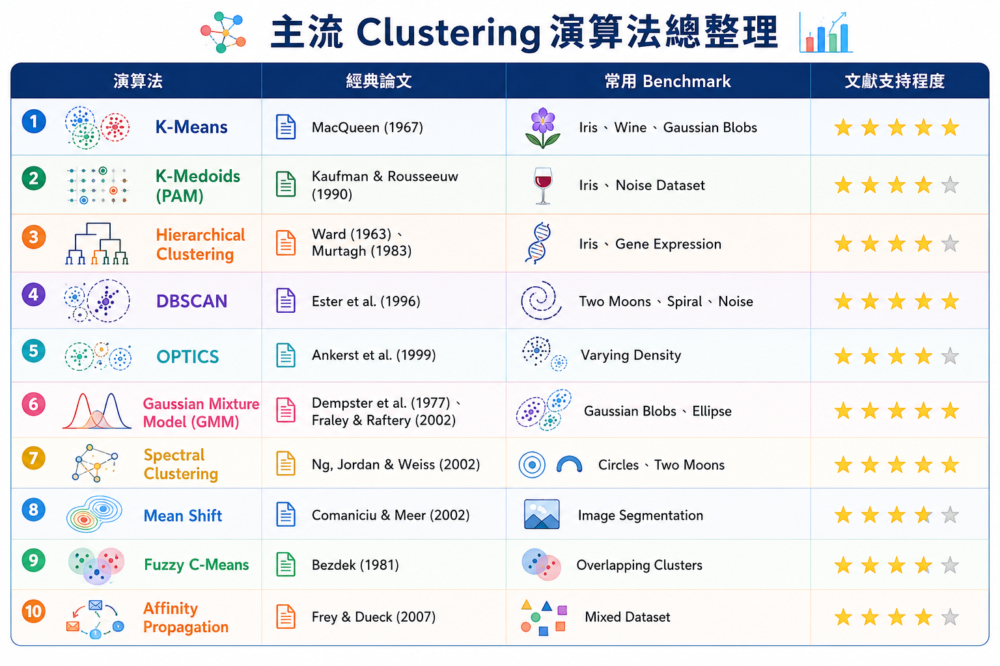
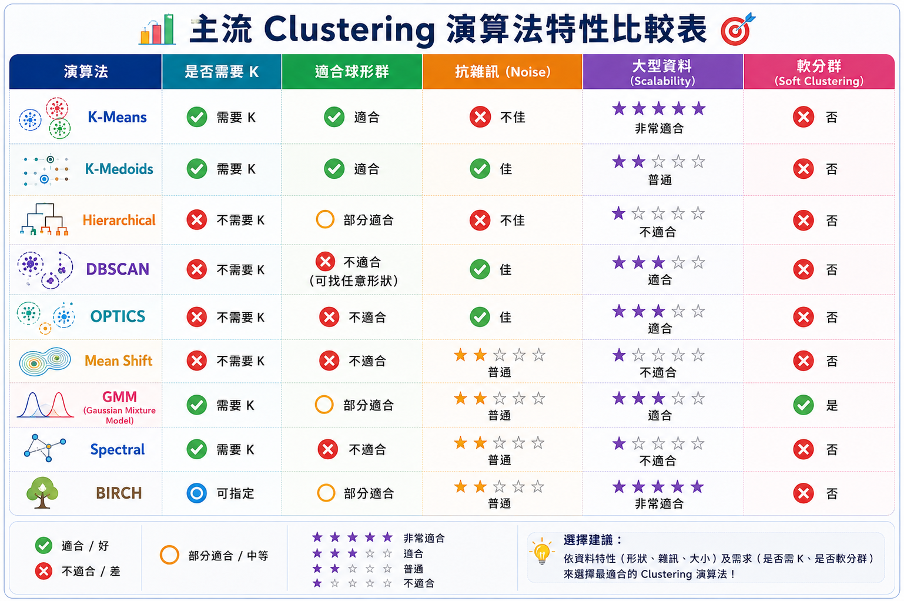
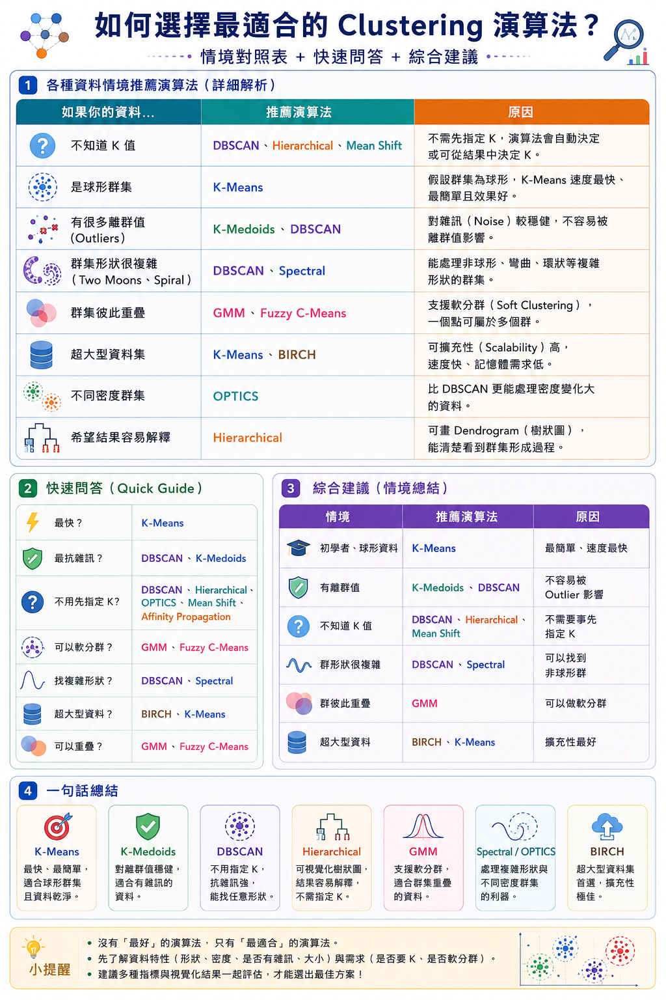

# Clustering 機器學習分群演算法學習與整理專案 (Copilot 版本)

歡迎來到 **Clustering（分群演算法）** 學習與分析筆記。本專案整理了無監督學習中核心分群演算法的家族架構、優缺點比較與適用場景分析，並包含完整的課堂討論與 AI 協同紀錄。

---

## 🎨 設計與風格規範 (Web Design Preferences)
本專案網頁端遵循 **水墨洗鍊與簡約白紙風格**：
- **主背景：** `#ffffff` (純白宣紙底色)。
- **介面色彩：** 採用高對比且具有東方美學的硃砂紅（`#9e2a2b`）與古金色（`#8c6b12`）作為主色調。
- **排版：** Noto Sans TC / Montserrat 字體，搭配精美細緻的微毛玻璃卡片（Glassmorphism）與淡墨背景浮水印。
- **SVG 圖解示意：** 以生動直觀的 SVG 幾何圖形呈現各分群演算法的資料劃分邏輯。

---

## 📖 什麼是分群演算法 (Clustering)？

> **白話比喻：** 「Clustering」不是一種演算法，而是一整個家族。就像「水果」是個家族，裡面有蘋果、香蕉、西瓜；而 K-Means 只是其中一種水果。
> 
> **正式定義：** 分群（Clustering）是無監督學習（Unsupervised Learning）中最核心的任務。它的目標是將未標記的數據集劃分為多個子集（群集 / Clusters），使得同一個群集內部的數據點相似度高，而不同群集之間的相似度低。

---

## 🌳 Clustering 家族架構

```
Clustering Algorithms
│
├── Partitioning (劃分式)
│      ├── K-Means (平均群心)
│      ├── K-Medoids (真實點群心 - PAM)
│      └── Fuzzy C-Means (模糊分群)
│
├── Hierarchical (層次式)
│      └── Agglomerative (凝聚型樹狀)
│
├── Density-based (密度式)
│      └── DBSCAN (核心與鄰域擴張)
│
├── Model-based (模型式)
│      └── Gaussian Mixture (混合高斯 - GMM)
│
├── Graph-based (圖論式)
│      └── Spectral Clustering (譜分群)
│
└── Deep Clustering (深度分群)
       └── AutoEncoder + K-Means (自編碼降維分群)
```



---

## 📊 K-Means vs K-Medoids

| 比較維度 | K-Means | K-Medoids (PAM) |
| :--- | :--- | :--- |
| **群心定義** | **Centroid (平均值)**：群內所有點的幾何平均。群心**可不存在**於真實資料中。 | **Medoid (中心點)**：群內與其他所有點的距離和（如 $L_1$ 距離）最小的**真實資料點**。 |
| **抗噪能力** | 較差。容易受到離群值 (Outliers) 影響而使群心大幅偏移。 | 較強。因群心鎖定在真實數據點上，對離群值的敏感度低。 |
| **計算複雜度** | 較低。計算迅速，適合處理大規模數據。 | 較高。每一步都需要計算群內兩兩點的距離和，適用於小數據集。 |



---

## 🎯 十大常見資料分佈模式 (Top 10 Data Patterns)

1. **Gaussian Blobs (高斯群聚)**：圓形、凸型分佈，各方向變異度一致，最適合 K-Means / GMM。
2. **Concentric Circles (同心雙環)**：嵌套的環形，具有非凸邊界，K-Means 無法分離，適合 Spectral / Kernel K-Means。
3. **Two Moons (雙月牙形)**：交錯的半月形，屬於流形分佈，適合 DBSCAN / Spectral。
4. **Spiral (雙螺旋線)**：高度非線性的連續曲線，適合 Spectral / DBSCAN / 深度分群。
5. **Anisotropic (橢圓拉伸)**：旋轉延伸的橢圓分佈，適合 GMM 估計協方差。
6. **Varying Density (密度不一)**：有些區域稠密、有些稀疏，適合 HDBSCAN / OPTICS。
7. **Noise & Outliers (噪聲噪點)**：散落的孤立背景雜訊，DBSCAN 能自動去噪歸類。
8. **Overlapping (高度重疊)**：邊界模糊，適合使用 GMM 進行「軟分配」機率估算。
9. **Imbalanced (規模不對等)**：群集大小或數量極不均衡，適合層次式分群或 GMM。
10. **High Dimension (高維特徵)**：特徵維度高導致距離失效（維度災難），適合 Spectral (結合降維) 或 Deep Clustering。



---

## 📄 經典學術引註 (References)

- **K-Means：** MacQueen, J. (1967). *Some Methods for Classification and Analysis of Multivariate Observations.*
- **K-Medoids / PAM：** Kaufman, L., & Rousseeuw, P. J. (1990). *Finding Groups in Data: An Introduction to Cluster Analysis.*
- **DBSCAN：** Ester, M. et al. (1996). *A Density-Based Algorithm for Discovering Clusters in Large Spatial Databases with Noise.*
- **Spectral Clustering：** Ng, A. Y., Jordan, M. I., & Weiss, Y. (2002). *On Spectral Clustering: Analysis and an Algorithm.*
- **綜合 Survey：** Jain, A. K. (2010). *Data Clustering: 50 Years Beyond K-Means.*

---

## 📂 資料夾文件說明
- 📄 **網頁入口：** [index.html](./index.html)
- 📄 **樣式規範：** [styles.css](./styles.css)
- 📄 **ChatGPT 課堂討論原始檔：** [clustering_text.txt](./clustering_text.txt)
- 📄 **ChatGPT PDF 備份：** [Clustering 演算法 ChatGPT 20260707.pdf](./Clustering%20演算法%20ChatGPT%2020260707.pdf)
- 📄 **Copilot 協同對話日誌：** [copilot.md](./copilot.md)
- 🖼️ **圖像資源目錄：** [assets/](./assets)
